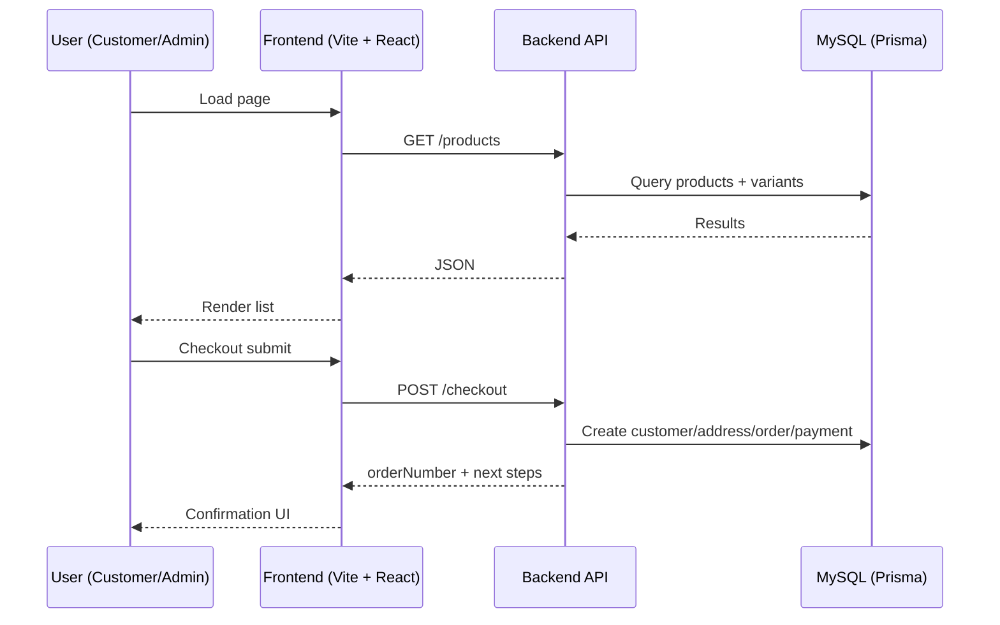
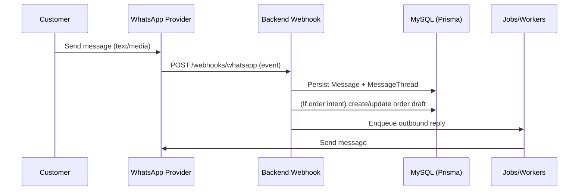

# Backend / Frontend / WhatsApp Flows (Separated)

This document separates the system into three views to make implementation and debugging easier.

## Backend Flow (API + DB + Jobs)

```mermaid
flowchart TD
  A[HTTP Request] --> B[Express Router]
  B --> C[Validation middleware (Zod)]
  C --> D[Controller]
  D --> E[Service]
  E --> F[Prisma (MySQL)]
  E --> G[Write AuditLog]
  E --> H[Enqueue jobs]
  H --> I[Worker sends Email]
  H --> J[Worker sends WhatsApp]

  F --> K[Response DTO]
  K --> L[HTTP Response]
```

Notes:
- `backend/src/main.ts` is responsible for env loading via `dotenv/config` and starting the server.
- Jobs/workers are for side effects (email/WhatsApp) so API requests stay fast.

## Frontend Flow (Website + Admin Panel)



Notes:
- Admin Panel uses `/admin/*` endpoints and requires auth (implementation detail lives in backend plan).

## WhatsApp Flow (Inbound Webhook + Outbound Messages)



Notes:
- Provider-specific verification, templates, and message constraints are driven by PRD open questions.
