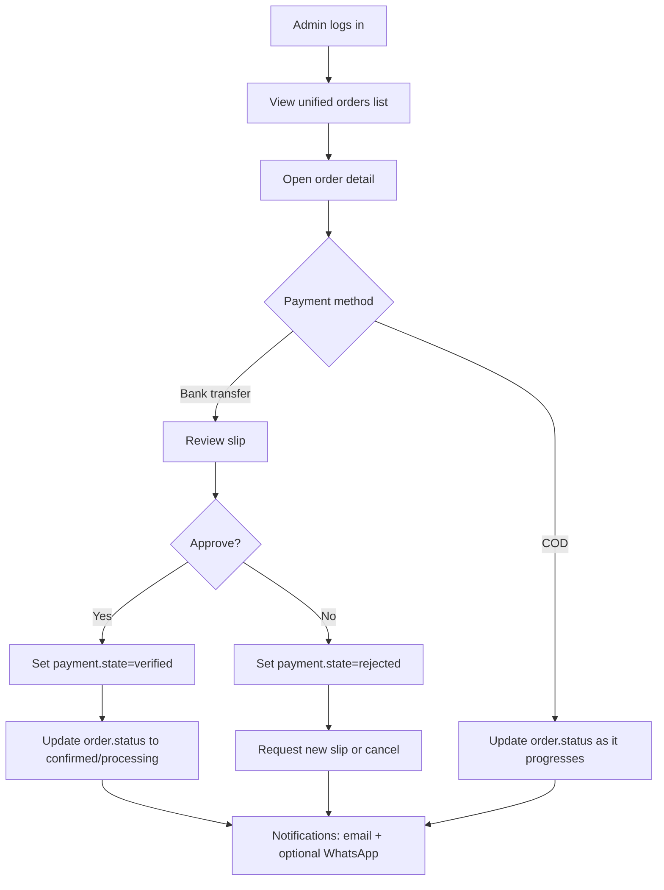
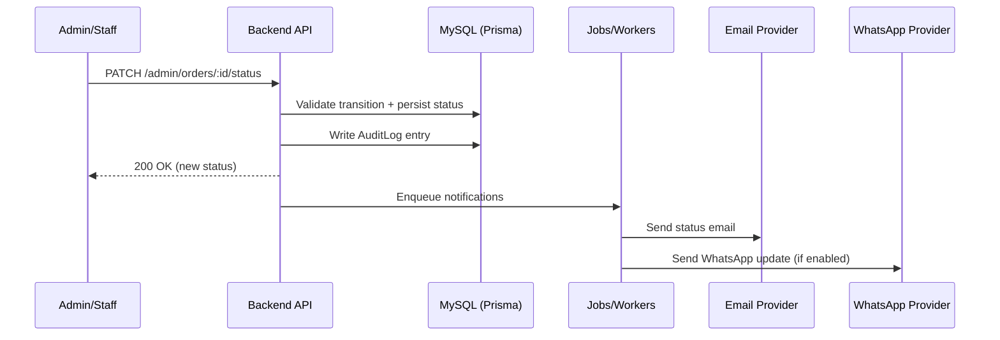

# Customer + Admin Flows

This document describes the high-level **customer** and **admin/staff** flows for the MVP defined in `docs/home-business-automation-prd.md`.

## Customer Flows

### A) Website Checkout (Guest)

```mermaid
flowchart TD
  A[Customer browses products] --> B[Add to cart]
  B --> C[Checkout: customer + delivery details]
  C --> D{Choose payment method}

  D -->|COD| E[Confirm order]
  E --> F[Order created: channel=web, payment.method=cod]
  F --> G[Email confirmation]

  D -->|Bank transfer| H[Show bank details + amount]
  H --> I[Upload slip image]
  I --> J[Confirm order]
  J --> K[Order created: payment.method=bank_transfer, payment.state=pending/review]
  K --> L[Email: payment instructions / received]

  D -->|Gateway (later)| M[Redirect to payment gateway]
  M --> N[Gateway webhook confirms payment]
  N --> O[Order updated: payment.state=verified]
  O --> P[Email confirmation]
```

### B) WhatsApp Inquiry -> Order

Provider-specific details are intentionally abstracted; see PRD constraints in `docs/home-business-automation-prd.md`.

```mermaid
flowchart TD
  A[Customer messages on WhatsApp
product code/link/name] --> B[WhatsApp provider posts webhook]
  B --> C[Backend verifies + parses message]
  C --> D[Lookup product/variant by SKU]
  D --> E[Send product details reply]
  E --> F[Customer confirms variant + qty + delivery]
  F --> G[Backend captures order draft]
  G --> H{Choose payment method}

  H -->|COD| I[Create order + payment(method=cod)]
  I --> J[Send WhatsApp confirmation + optional email]

  H -->|Bank transfer| K[Send bank details + amount]
  K --> L[Customer sends slip image]
  L --> M[Backend stores slip + creates payment(state=review)]
  M --> N[Create order]
  N --> O[Send WhatsApp acknowledgement]
```

## Admin/Staff Flows

### C) Admin Order Processing + Payment Review



### D) Status Updates


