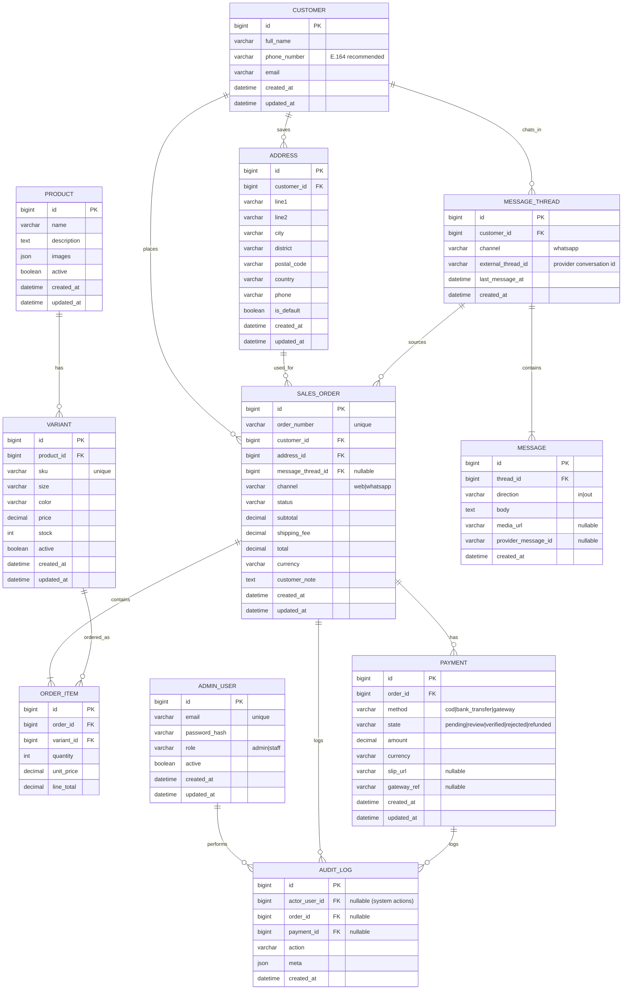

# ER Diagram (MySQL)

## Entities (What Each One Does)

### PRODUCT
Represents a sellable product concept (e.g., "Oversized Hoodie"). Holds shared info like name, description, and photos.

Key fields:
- `active`: hide/show product.
- `images`: list of image URLs (can be JSON).

### VARIANT
Represents a specific purchasable option of a product (e.g., size M, color Black). This is what customers actually buy.

Key fields:
- `product_id`: connects the variant to its product.
- `sku`: unique code used for lookup from WhatsApp messages and internal tracking.
- `price`, `stock`: controls ordering and availability.

### CUSTOMER
Represents a buyer. Unifies website checkout and WhatsApp chat customers.

Key fields:
- `phone_number`: used to match inbound WhatsApp messages and website checkout.
- `email`: used for Gmail notifications.

### ADDRESS
Saved shipping/delivery addresses for a customer. Orders reference a specific address so historical orders remain correct even if the customer later edits their address.

For this project, the website checkout form includes: address, district, city, and postal code. Those map directly into this entity.

Key fields:
- `customer_id`: owner of the address.
- `is_default`: convenience for website checkout.

### SALES_ORDER
Represents a single order placed by a customer, from either WhatsApp or the website.

Key fields:
- `order_number`: human-friendly identifier shown in email/admin.
- `channel`: where the order originated (`web` or `whatsapp`).
- `status`: order lifecycle (e.g., `new`, `payment_review`, `confirmed`, `shipped`, `delivered`).
- `message_thread_id`: links to the WhatsApp conversation if the order came from chat.
- `subtotal`, `shipping_fee`, `total`, `currency`: totals used for payment and reporting.

### ORDER_ITEM
Line items inside an order. Each row is one variant + quantity.

Key fields:
- `variant_id`: what was sold.
- `unit_price`: price at time of purchase (important if prices change later).

### PAYMENT
Represents a payment attempt or payment record for an order.

Key fields:
- `method`: COD, bank transfer, or gateway.
- `state`: verification state (bank slips need manual approval, gateways can be auto-verified).
- `slip_url`: stored proof image for bank transfers.
- `gateway_ref`: payment provider reference for reconciliation.

### MESSAGE_THREAD
Represents a conversation with a customer on a channel (initially WhatsApp). Used to group messages and link chat-driven orders.

Key fields:
- `external_thread_id`: provider conversation ID (helps debugging and message sending).

### MESSAGE
Stores individual inbound and outbound messages (text and optional media). Useful for support, dispute handling, and tracking what the bot told the customer.

Key fields:
- `direction`: inbound from customer or outbound from system.
- `media_url`: WhatsApp images (e.g., payment slips) or other attachments.

### ADMIN_USER
Represents admin/staff users who log into the admin panel.

Key fields:
- `role`: authorization (admin vs staff).
- `password_hash`: store hashed password only.

### AUDIT_LOG
Records important changes for accountability (payment approvals, status changes, manual edits).

Key fields:
- `actor_user_id`: which admin/staff did it (nullable for automated/system actions).
- `order_id` / `payment_id`: links audit entries to the affected record.
- `action` + `meta`: what happened and details (old/new values).

## Relationships (Cardinality + Meaning)

### PRODUCT 1 to many VARIANT
One product can have many variants. A variant belongs to exactly one product.

Why:
- Clothing almost always has size/color combinations.
- Inventory and pricing are usually managed per variant.

### CUSTOMER 1 to many ADDRESS
One customer can save multiple addresses. Each address belongs to one customer.

Why:
- Customers may ship to home/work or different recipients.

### CUSTOMER 1 to many SALES_ORDER
One customer can place many orders. Each order belongs to one customer.

Why:
- Enables order history, repeat buyers, and unified identity across website + WhatsApp.

### ADDRESS 1 to many SALES_ORDER
An order uses exactly one address. The same address record can be reused by multiple orders.

Why:
- Preserves the shipping details used at checkout for that specific order.

### SALES_ORDER 1 to many ORDER_ITEM
An order contains one or more order items. Each order item belongs to exactly one order.

Why:
- Standard cart/checkout structure.

### VARIANT 1 to many ORDER_ITEM
A variant can appear in many order items over time. Each order item references one variant.

Why:
- Reports like “how many size M black hoodies sold” are based on variants.

### SALES_ORDER 1 to many PAYMENT (optional)
An order can have zero, one, or multiple payment records (for example: customer re-sends a slip, partial payment, or retries a gateway payment). Each payment belongs to one order.

Why:
- Real-world payments are messy; modeling retries avoids overwriting history.

### CUSTOMER 1 to many MESSAGE_THREAD
A customer can have multiple threads (usually one per WhatsApp number/channel). Each thread belongs to one customer.

Why:
- Keeps conversation history organized.

### MESSAGE_THREAD 1 to many MESSAGE
A thread contains many messages. Each message belongs to one thread.

Why:
- Needed for chat automation and later customer support.

### MESSAGE_THREAD 1 to many SALES_ORDER (optional)
A single WhatsApp thread can produce multiple orders over time. A website order may have no thread.

Why:
- Customers often reorder in the same chat.

### ADMIN_USER 1 to many AUDIT_LOG
An admin/staff user can create many audit log entries. Audit entries can also be system-generated with no actor user.

Why:
- Accountability and debugging.

### SALES_ORDER / PAYMENT 1 to many AUDIT_LOG (optional)
Orders and payments can have many audit events. Some events may only relate to an order, only to a payment, or to both.

Why:
- Track payment approvals, rejections, status changes, and corrections.

## Practical Constraints (Recommended)
- `VARIANT.sku` unique.
- `SALES_ORDER.order_number` unique.
- Consider a unique composite key for variants per product: (`product_id`, `size`, `color`) to prevent duplicates.
- Store money as `DECIMAL(10,2)` (or appropriate scale) and always store `currency`.
